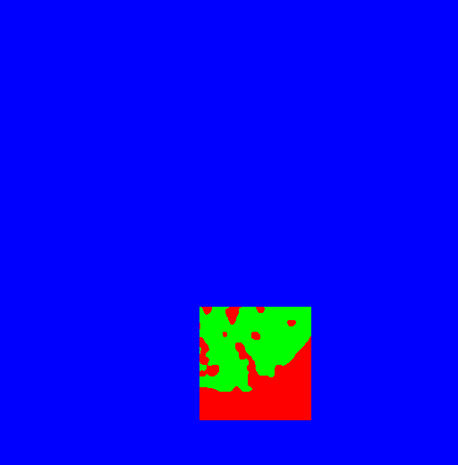

## Less-than-one shot 3D segmentation hijacking a pre-trained Space-Time Memory network
### Cyril Li, Christophe Ducottet, Sylvain Desroziers, Maxime Moreaud
### ACIVS 2023

The paper will be available at a later date.

### Requirements
- python 3.6
- pytorch 1.0.1.post2
- numpy, opencv, pillow

### How to Use
#### Download weights
##### Place it in the same folder with demo scripts
```
wget -O STM_weights.pth "https://www.dropbox.com/s/mtfxdr93xc3q55i/STM_weights.pth?dl=1"
```

#### Run
##### Run the sample test
```
python hi-STM.py -ann data/zeolite/ann/an00029.png -img data/zeolite/ann/00029.png -vol data/zeolite/vols 
```

- `-ann` directs to the file with the annotations
- `-img` is the image of the annotated slice
- `-vol`refers to the folder with images to segment
The output `test` and `viz` are at the same level as `-vol`.

##### Annotations


- Red: background
- Green: object
- Blue: unlabeled


##### Other parameters
- `-F` put the pseudo label of the annotation slice in the memory (more details in our paper)
- `-STM` runs with the original [STM network](https://github.com/seoungwugoh/STM)


